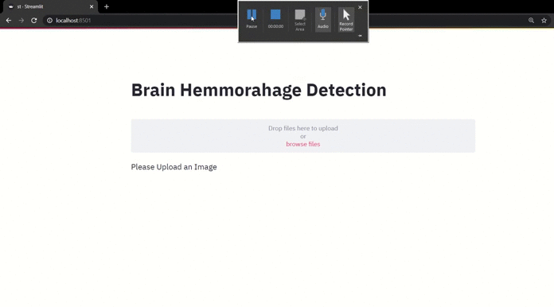
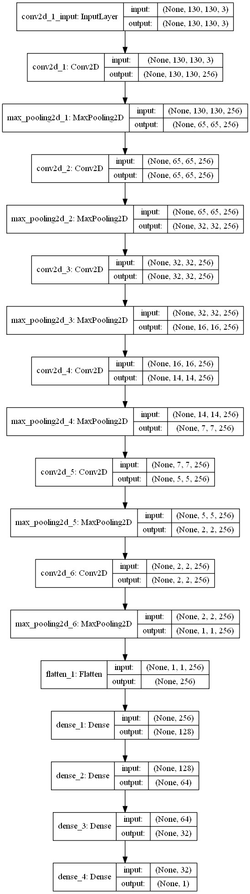

# Brain-Hemorrhage-Detection

## Stremlit Webapp

### Goal: 
To classify whether a person has brain hemorrhage or not using CT scan image of brain.

### Dataset Source:
Kaggle

## CNN Model Architecture 

